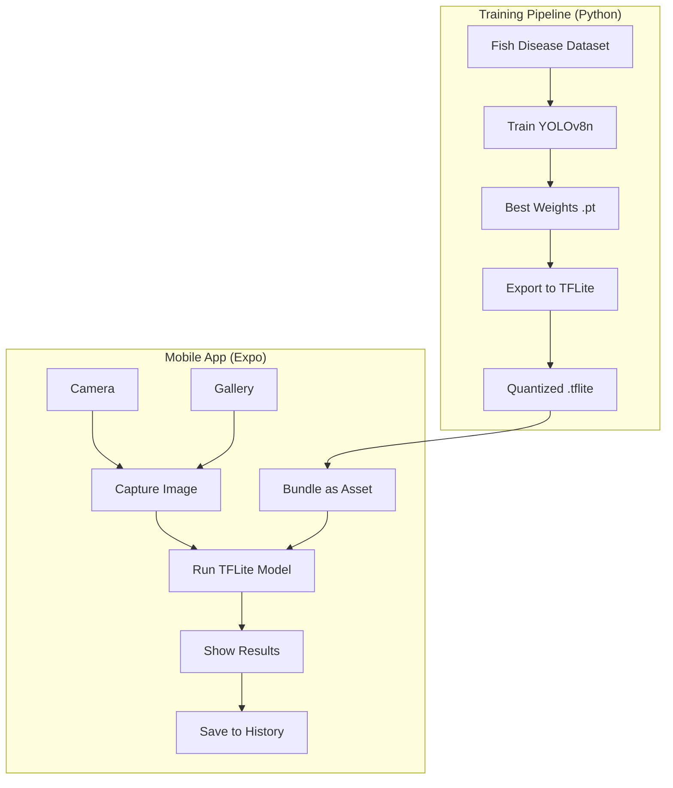

# Design Document

## Overview

Mina is an offline-first mobile app for real-time fish disease detection. The system has two main parts:

1. **Training Pipeline (Python)**: Uses ultralytics to train a YOLOv8n model on fish disease images, then exports to TFLite for mobile
2. **Mobile App (Expo)**: Runs the TFLite model on-device for instant offline detection

**Core principles:**
- Speed: Under 2 seconds from capture to results
- Simplicity: 2 taps from launch to analysis
- Offline: All ML runs locally on your phone
- Beautiful: Polished UI with smooth animations

## Architecture



### Tech Stack

**Python Training Pipeline**

| Component | Tech | Why |
|-----------|------|-----|
| ML Framework | ultralytics | Official YOLOv8 implementation |
| Model | YOLOv8n | Nano variant optimized for mobile |
| Export | ONNX → TFLite | Mobile-optimized format |
| Quantization | int8 | Smaller model, faster inference |

**Mobile App (Expo)**

| Layer | Tech | Why |
|-------|------|-----|
| Framework | Expo SDK 54 | Cross-platform React Native |
| Styling | NativeWind | TailwindCSS for React Native |
| Navigation | Expo Router | File-based routing |
| Camera | expo-camera | Camera access |
| ML Inference | react-native-fast-tflite | On-device TFLite inference |
| Storage | AsyncStorage | Local persistence |
| Animations | react-native-reanimated | Smooth transitions |
| Haptics | expo-haptics | Tactile feedback |

## YOLOv8 Training Pipeline

### Dataset Structure

```
model/
  data/
    images/
      train/          # Training images
      val/            # Validation images
    labels/
      train/          # YOLO format labels (.txt)
      val/            # YOLO format labels (.txt)
    data.yaml         # Dataset config
```

### data.yaml Config

```yaml
path: ./data
train: images/train
val: images/val

names:
  0: bacterial_infection
  1: fungal_infection
  2: healthy
  3: parasite
  4: white_tail
```

### Training Script

```python
from ultralytics import YOLO

# Load YOLOv8 nano model
model = YOLO("yolov8n.pt")

# Train on fish disease data
results = model.train(
    data="data/data.yaml",
    epochs=100,
    imgsz=640,
    batch=16,
    name="fish_disease"
)

# Export to TFLite with int8 quantization
model.export(format="tflite", int8=True)
```

### Model Output Format

The TFLite model outputs detections in YOLO format:

```
[x_center, y_center, width, height, confidence, class_id]
```

All coordinates are normalized (0-1). The inference service converts center coordinates to top-left:

```typescript
// Convert YOLO center format to top-left format
const boundingBox = {
  x: x_center - width / 2,
  y: y_center - height / 2,
  width,
  height
}
```

## Components and Interfaces

### UI Components

**CameraView** - Live camera preview with capture button

```typescript
type CameraViewProps = {
  onCapture: (imageUri: string) => void
  onGallerySelect: () => void
}
```

**DetectionOverlay** - Draws bounding boxes on the analyzed image

```typescript
type DetectionOverlayProps = {
  imageUri: string
  detections: Detection[]
  animated?: boolean
}
```

**DetectionResultCard** - Shows one detection with disease name and confidence

```typescript
type DetectionResultCardProps = {
  detection: Detection
  onPress: () => void
}
```

**HistoryList** - Scrollable list of past scans

```typescript
type HistoryListProps = {
  sessions: DetectionSession[]
  onSessionPress: (sessionId: string) => void
}
```

### Services

**InferenceService** - Runs the YOLOv8 model on images

```typescript
type InferenceService = {
  loadModel: () => Promise<void>
  isModelLoaded: () => boolean
  runInference: (imageUri: string) => Promise<Detection[]>
  dispose: () => void
}
```

**StorageService** - Saves and loads detection history

```typescript
type StorageService = {
  saveSession: (session: DetectionSession) => Promise<void>
  getSessions: () => Promise<DetectionSession[]>
  getSession: (id: string) => Promise<DetectionSession | null>
  deleteSession: (id: string) => Promise<void>
  clearAll: () => Promise<void>
}
```

## Data Models

### BoundingBox

Where a detection was found in the image (normalized 0-1 coordinates)

```typescript
type BoundingBox = {
  x: number       // left edge
  y: number       // top edge
  width: number
  height: number
}
```

### Detection

A single disease detection from the model

```typescript
type DiseaseClass = 
  | "bacterial_infection"
  | "fungal_infection"
  | "healthy"
  | "parasite"
  | "white_tail"

type Detection = {
  id: string
  diseaseClass: DiseaseClass
  confidence: number      // 0.0 to 1.0
  boundingBox: BoundingBox
}
```

### DetectionSession

A complete scan with image and all detections

```typescript
type DetectionSession = {
  id: string
  imageUri: string
  detections: Detection[]
  timestamp: number       // Unix ms
}
```

### DiseaseInfo

Static info about each disease type

```typescript
type Severity = "low" | "medium" | "high"

type DiseaseInfo = {
  diseaseClass: DiseaseClass
  displayName: string
  description: string
  symptoms: string[]
  treatments: string[]
  severity: Severity
}
```

### JSON Format

Sessions are stored as JSON:

```json
{
  "id": "session_123",
  "imageUri": "file:///path/to/image.jpg",
  "detections": [
    {
      "id": "det_001",
      "diseaseClass": "fin_rot",
      "confidence": 0.87,
      "boundingBox": {
        "x": 0.25,
        "y": 0.30,
        "width": 0.40,
        "height": 0.35
      }
    }
  ],
  "timestamp": 1732550400000
}
```

## Correctness Properties

*A property is a characteristic or behavior that should hold true across all valid executions of a system-essentially, a formal statement about what the system should do. Properties serve as the bridge between human-readable specifications and machine-verifiable correctness guarantees.*

### Property 1: Detection session round-trip

*For any* valid DetectionSession, serializing it to JSON and then parsing it back SHALL produce an equivalent DetectionSession with identical field values.

**Validates: Requirements 4.4, 4.5**

### Property 2: Confidence filtering

*For any* list of raw detections from the model, filtering SHALL remove all detections with confidence below 0.3 and keep all detections with confidence 0.3 or above.

**Validates: Requirements 4.3**

### Property 3: Detection sorting by confidence

*For any* list of detections, when sorted for display, each detection's confidence SHALL be greater than or equal to the next detection's confidence (descending order).

**Validates: Requirements 3.3**

### Property 4: History sorting by timestamp

*For any* list of detection sessions, when displayed in history, each session's timestamp SHALL be greater than or equal to the next session's timestamp (newest first).

**Validates: Requirements 5.4**

### Property 5: Detection result structure

*For any* detection returned by the model, it SHALL contain a valid diseaseClass, a confidence between 0.0 and 1.0, and a boundingBox with x, y, width, height all between 0.0 and 1.0.

**Validates: Requirements 4.2**

### Property 6: Disease info completeness

*For any* DiseaseClass value, there SHALL exist a corresponding DiseaseInfo entry with a non-empty displayName, description, at least one symptom, and at least one treatment.

**Validates: Requirements 6.1, 6.2**

### Property 7: Bounding box color mapping

*For any* detection, the bounding box color SHALL be determined by the diseaseClass: green for "healthy", yellow for low severity diseases, red for medium/high severity diseases.

**Validates: Requirements 8.3**

### Property 8: TFLite export equivalence

*For any* test image, the TFLite model output SHALL produce detections equivalent to the original PyTorch model output (same classes, similar confidence scores within 0.05 tolerance).

**Validates: Design - Training Pipeline**

## Error Handling

| Scenario | Response |
|----------|----------|
| Camera permission denied | Show explanation message with link to settings |
| Model fails to load | Show error with retry button |
| Inference fails | Show friendly error, offer to retry or pick different image |
| Storage full | Warn user, suggest clearing old history |
| Invalid image format | Show message asking for JPEG or PNG |

## Testing Strategy

### Property-Based Testing

**TypeScript (Expo App)**: We use **bun:test** for property-based testing. Each correctness property maps to a property-based test that generates random inputs and verifies the property holds.

**Python (Training Pipeline)**: We use **hypothesis** for property-based testing of model export and inference equivalence.

Configuration:
- Minimum 100 iterations per property test
- Each test tagged with: `**Feature: fish-disease-detection, Property {N}: {description}**`

### Unit Tests

Unit tests cover:
- Component rendering with various props
- Service method behavior with specific inputs
- Edge cases like empty arrays and boundary values
- Model training configuration validation
- Export format verification

### Test Organization

```
model/
  tests/
    test_training.py         # Training config tests
    test_export.py           # TFLite export equivalence (Property 8)
    test_inference.py        # Model output format tests

app/
  __tests__/
    models/
      detection.test.ts      # Property tests for data models
      serialization.test.ts  # Round-trip property tests
    services/
      inference.test.ts      # Inference service tests
      storage.test.ts        # Storage service tests
    components/
      DetectionOverlay.test.tsx
      HistoryList.test.tsx
```
